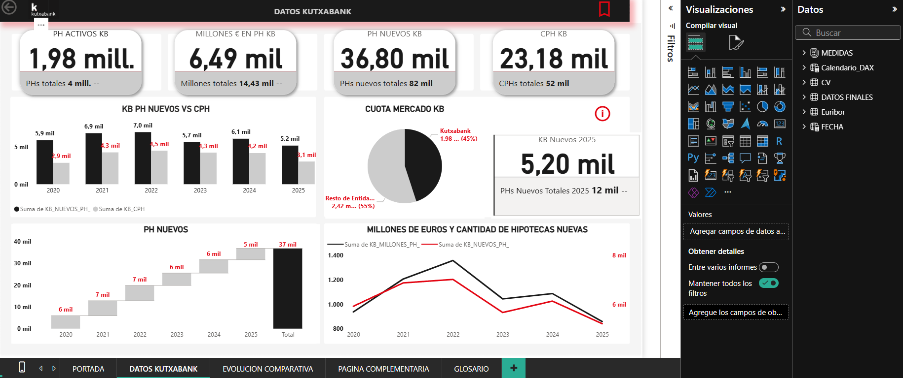
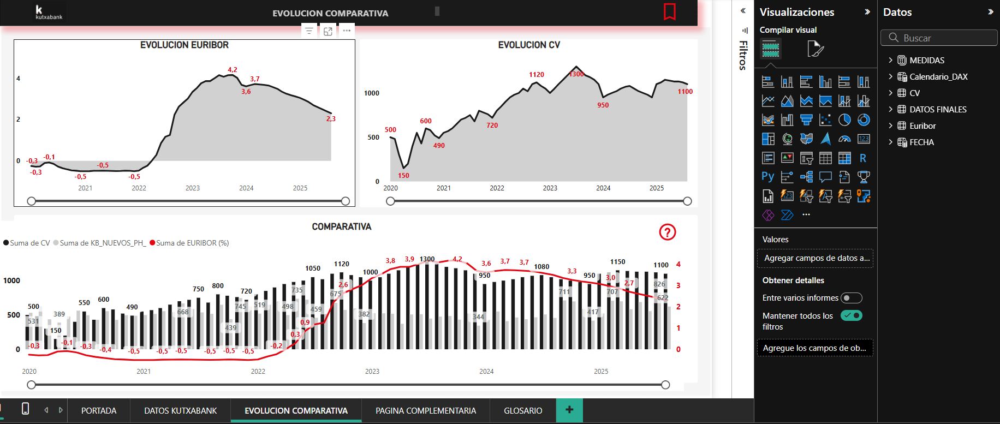

# Análisis de Hipotecas Kutxabank - Bizkaia (2020-2025)

## 📊 Descripción del Proyecto
Este proyecto de Business Analytics analiza la evolución del mercado hipotecario en Bizkaia, con foco específico en la entidad **Kutxabank**. El objetivo fue modelar datos macroeconómicos para entender las tendencias de concesión vs cancelación de préstamos y comparativas respecto a la evolución del Euríbor y la cantidad de compraventas.

🔗 **[Ver Informe Completo en PDF](./Informe%20trabajo%20power%20bi%20Julen%20Corral.pdf)** 

## 🖼️ Vistazo al Dashboard

### Tablero Principal: Datos Kutxabank
Aquí se visualizan los KPIs principales y la cuota de mercado estimada del 45%.
 

### Evolución Comparativa
Análisis temporal comparando el volumen de hipotecas con la evolución del Euríbor y las compraventas.

## 🛠️ Tecnologías y Habilidades Aplicadas

* **ETL & Power Query:**
    * Recopilación y normalización de datos dispersos del INE (Formatos de fecha heterogéneos).
    * Combinación de consultas (Merge) para unificar hipotecas constituidas, canceladas y activas.
    * Generación de datos estimados mediante lógica de negocio para suplir la falta de datos públicos de la entidad.
* **Modelado de Datos & DAX:**
    * Creación de **Tabla Calendario** dinámica con DAX para inteligencia de tiempo.
    * Modelo en estrella relacionando tablas de hechos (Hipotecas, Compraventas, Euríbor) con dimensiones.
    * Medidas calculadas para porcentajes de cuota de mercado y totales acumulados.
* **Visualización Avanzada (UX/UI):**
    * Uso de **Parámetros de Campo** para permitir al usuario cambiar dinámicamente entre vistas anuales y mensuales.
    * Navegación mediante **Marcadores** y botones personalizados.
    * Diseño corporativo adaptado (Tema personalizado).

## 🗂️ Fuentes de Datos
* **INE (Instituto Nacional de Estadística):** Hipotecas constituidas y canceladas, Transmisiones de derechos de propiedad.
* **Euríbor:** Datos históricos y estimaciones para la serie 2020-2025.
* **Kutxabank:** Estimaciones basadas en cuota de mercado pública.

---
*Autor: Julen Corral*
